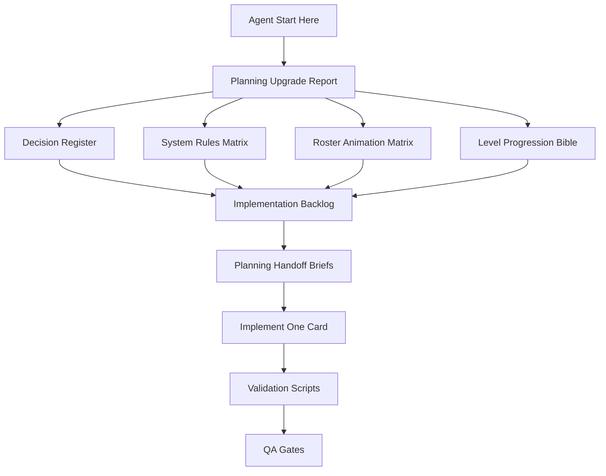

# Project Animal Match Planning Upgrade Report

작성일: 2026-05-02
미션: 기획 에이전트 3명을 소환해 현재 기획을 논의하고, 개발 에이전트가 바로 확인해 작업할 수 있는 수준으로 기획을 고도화한다.

## 1. 결론

초기 문서의 큰 방향은 유지하되, 개발 착수에 필요한 구체성이 부족한 부분을 보강했다. 이번 고도화의 핵심은 새 아이디어를 무한히 추가하는 것이 아니라, 기획을 코드/데이터/QA가 확인 가능한 계약으로 바꾸는 것이다.

가장 중요한 변경은 다음 다섯 가지다.

1. 동물 운영을 `MVP 보드 12종`, `글로벌 런칭 컬렉션 18종`, `시즌 운영 24종`으로 분리했다.
2. 보드에 동시에 등장하는 동물은 5-6종으로 제한해 매치 확률과 모바일 가독성을 유지한다.
3. 표정 애니메이션은 `idle`, `blink`, `smile`, `match`, `fever`, `worried` 6개 상태를 MVP 계약으로 고정했다.
4. 피버는 초 단위가 아니라 `3회 플레이어 이동` 기준으로 고정하고, 8초는 VFX 상한으로만 둔다.
5. 다음 개발 에이전트가 바로 집을 수 있도록 Fever, Rescue Buddy, 동물 애니메이션, 레벨 진행, 분석 계약 작업 브리프를 만들었다.

## 2. 참여 기획 에이전트 결과

| 에이전트 | 산출물 | 핵심 기여 |
| --- | --- | --- |
| Core Loop & Systems Planner | `docs/planning/project-animal-match-core-loop-agent-review.md` | 피버 3턴 기준, 특수 처리 순서, Rescue Buddy MVP, SpecialEffectQueue 후보 |
| Level Balance & Progression Planner | `docs/planning/project-animal-match-level-balance-agent-review.md` | 12종 로스터 해금 순서, pool 5-6종 제한, hard/recovery 파형, validator 강화 |
| UX Retention & Player Motivation Planner | `docs/planning/project-animal-match-ux-retention-agent-review.md` | Level 5 첫 세션 목표, Rescue Book 메타, 실패 제안 분류, 분석 이벤트 보강 |

통합본은 `docs/planning/project-animal-match-planning-council-synthesis.md`에 정리했다.

## 3. 추가 고도화 산출물

| 문서 | 용도 |
| --- | --- |
| `docs/planning/project-animal-match-decision-register.md` | 확정/미결정 기획 판단 추적 |
| `docs/planning/project-animal-match-system-rules-matrix.md` | 시스템별 입력, 출력, 예외, QA 기준 |
| `docs/planning/project-animal-match-ftue-rescue-book-spec.md` | Level 1-10 FTUE와 Rescue Book 메타 루프 |
| `docs/planning/project-animal-match-analytics-remote-config-spec.md` | 분석 이벤트와 원격 설정 계약 |
| `docs/planning/project-animal-match-rescue-buddy-skill-spec.md` | 동물 스킬 MVP인 Rescue Buddy 세부 규칙 |
| `docs/planning/project-animal-match-animal-roster-animation-matrix.md` | 동물 수 확장, 표정 애니메이션, atlas/data 계약 |
| `docs/planning/project-animal-match-level-progression-content-bible.md` | 100스테이지 밴드별 학습/난이도/해금 기준 |
| `.codex/tasks/project-animal-match-planning-handoff-briefs-2026-05-02.md` | 다음 에이전트용 작업 브리프 묶음 |

## 4. 동물 수와 애니메이션 계획

### 4.1 로스터 계층

| 계층 | 수량 | 보드 투입 | 용도 |
| --- | ---: | --- | --- |
| MVP 보드 로스터 | 12 | 가능 | 스테이지 블록, 목표, Rescue Buddy 후보 |
| 글로벌 런칭 컬렉션 | 18 | 13-18번은 초기 보드 미투입 | Rescue Book, 이벤트 보상, 예고 |
| 시즌 운영 확장 | 24 | 성과 검증 후 순차 투입 | 시즌 패스, 기간 한정 수집, 신규 에피소드 |

동물 수는 늘리되, 보드 pool은 늘리지 않는다. 전체 수집감은 컬렉션에서 키우고, 실제 퍼즐 확률은 스테이지별 5-6종 pool로 지킨다.

### 4.2 표정 상태

| 상태 | 용도 | 구현 기준 |
| --- | --- | --- |
| `idle` | 기본 대기 | 정지 또는 미세 breathing |
| `blink` | 살아 있는 느낌 | 2.8-6.0초 랜덤, 동시 최대 4타일 |
| `smile` | 선택/힌트/목표 근접 | 0.20-0.30초, scale/tint fallback |
| `match` | 제거 직전 성공 반응 | 가장 높은 우선순위 |
| `fever` | 피버 고조감 | 목표/특수 타일 중심 loop |
| `worried` | 이동 수 3 이하/실패 직전 | 짧게 제한, 남용 금지 |

동물별 상세 연출은 `docs/planning/project-animal-match-animal-roster-animation-matrix.md`가 기준이다.

## 5. 핵심 시스템 결정

| 시스템 | 결정 |
| --- | --- |
| 피버 | 3회 플레이어 이동 지속, 8초는 VFX 상한 |
| 특수 블록 | 특수+특수 조합, 단일 특수, 일반 매치 제거 순서 |
| Rescue Buddy | 스테이지별 buddy 1종, 자동 1회 발동 MVP |
| FTUE | Level 1-10 수익화 금지, Level 5 첫 컬렉션 경험 |
| Rescue Book | MVP 12종 먼저, 런칭 18종까지 확장 가능 |
| 분석 | FTUE/피버/스킬/실패/광고/IAP/이벤트 전환점을 이벤트 계약으로 관리 |
| 레벨 진행 | 10스테이지 밴드, hard 후 recovery, finale/master 연속 제한 |

## 6. 다음 작업 우선순위

| 우선 | 작업 | 브리프 |
| ---: | --- | --- |
| 1 | `PAM-DEV-052` FeverController MVP | Brief A |
| 2 | `PAM-DEV-053` Rescue Buddy 동물 스킬 시스템 | Brief B |
| 3 | `PAM-ART-091` 동물 로스터/표정 애니메이션 제작 매트릭스 반영 | Brief C |
| 4 | `PAM-PLAN-092` 레벨 진행 콘텐츠 바이블 동기화 | Brief D |
| 5 | `PAM-ANA-090` 분석 이벤트 계약 검증기 | Brief E |

브리프 위치: `.codex/tasks/project-animal-match-planning-handoff-briefs-2026-05-02.md`

### 실행 흐름

## 7. 개발 에이전트 시작 절차

1. `docs/project-animal-match-agent-start-here.md`를 읽는다.
2. `docs/project-animal-match-agent-output-index.md`에서 필요한 산출물을 확인한다.
3. `docs/dev/project-animal-match-implementation-backlog.md` 또는 handoff briefs에서 카드 하나를 고른다.
4. 카드의 대상 파일 외 변경이 필요하면 이유를 작업 로그에 남긴다.
5. 스테이지 변경은 `./scripts/validate_stage_data.sh`와 `./scripts/validate_stage_balance.sh`를 실행한다.
6. 코드/씬 변경은 `./scripts/validate_gameplay.sh`를 실행한다.

## 8. 역할별 첫 행동

| 역할 | 첫 행동 | 완료 보고 |
| --- | --- | --- |
| PM Lead | handoff briefs에서 이번 스프린트 카드 2-3개를 고른다. | 카드 id, 담당, 제외 범위, 승인 기준 |
| Planning Lead | `OPEN-*` 결정 중 구현을 막는 항목만 닫는다. | 갱신한 decision id와 영향 문서 |
| Art Lead | `PAM-ART-091` 기준으로 12종 MVP 표정과 13-18번 컬렉션 카드 제작 티켓을 나눈다. | 동물별 에셋 우선순위와 누락 fallback |
| Technical Lead | `PAM-DEV-052`와 `PAM-DEV-053`의 controller/service 분리 범위를 정한다. | 대상 파일, 새 모듈, signal/data 계약 |
| Development Agent | handoff brief 하나를 선택하고 대상 파일 외 변경을 피한다. | 변경 파일, 검증 명령, 남은 리스크 |
| QA Lead | Gate 1, 7, 8, 10, 11을 이번 기획 확장 회귀 기준으로 삼는다. | 승인/반려, 재현 절차, 수동 확인 필요 항목 |

## 9. 남은 미결정

| ID | 내용 | 결정 시점 |
| --- | --- | --- |
| `OPEN-001` | 피버 게이지 충전 수치 | `PAM-DEV-052` 전 |
| `OPEN-002` | 첫 Rescue Buddy 대상 | `PAM-DEV-053` 전 |
| `OPEN-003` | Rescue Book 첫 해금 동물 | `PAM-UX-060` 전 |
| `OPEN-007` | 분석 SDK 공급자 | analytics 구현 전 |
| `OPEN-009` | 13-18번 컬렉션 동물의 보드 투입 순서 | 시즌 1 보드 확장 전 |

미결정 항목은 구현을 막는 경우에만 닫는다. 지금은 문서와 브리프가 fallback 가능한 가정으로 작성되어 있어 다음 개발 작업을 시작할 수 있다.

## 10. 검증 기록

이번 고도화 후 다음 검증을 통과했다.

- `./scripts/validate_stage_data.sh`
- `./scripts/validate_stage_balance.sh`
- `./scripts/validate_gameplay.sh`

세부 실행 기록은 `autonomy_execution_log.md`에 남긴다.

## 11. 보고서 판정

기획은 더 이상 “아이디어 목록” 상태가 아니다. 현재는 개발 에이전트가 문서를 읽고, 백로그/브리프에서 작업을 고르고, 대상 파일과 검증 명령을 따라 실제 구현으로 진입할 수 있는 상태다. 추가 기획은 가능하지만, 다음 고도화는 새 문서를 더 쓰는 것보다 `PAM-DEV-052`, `PAM-DEV-053`, `PAM-ART-091`, `PAM-PLAN-092`를 구현하면서 문서와 코드를 함께 동기화하는 방식이 적절하다.
